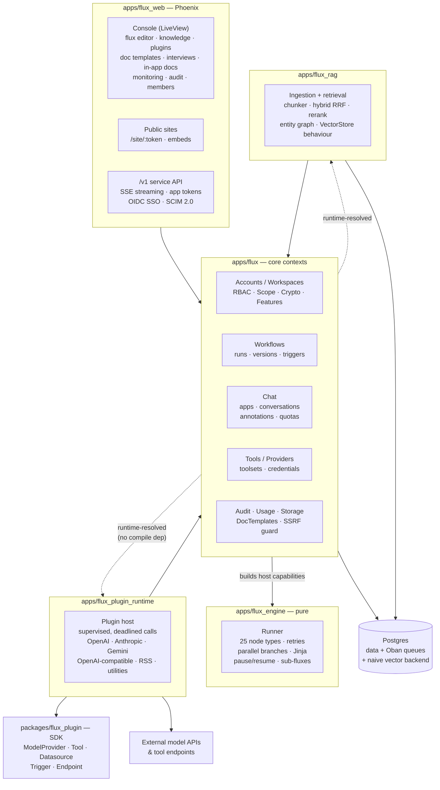
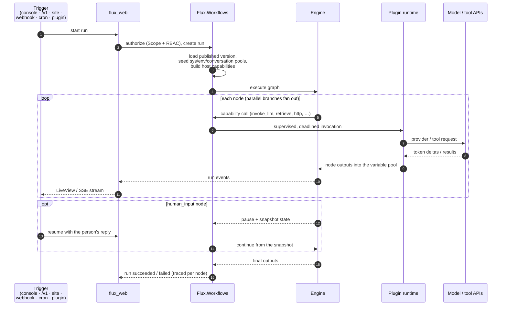

# ⚡ FluxCapacitor

*Where we're going, we don't need boilerplate.*

FluxCapacitor is a self-hostable platform for building, running, and publishing
AI-powered apps on the BEAM. You design **fluxes** — executable workflow graphs —
in a visual editor, wire them to models, tools, and knowledge bases, and ship
them as chat apps, form apps, embeddable widgets, or plain HTTP APIs. Everything
runs in one Elixir/Phoenix umbrella: no sidecar services, no external
orchestrator, no queue infrastructure beyond Postgres.

## What it does

- **Visual workflow engine** — 25 node types (LLM, agent loops, branching,
  iteration and bounded loops over sub-fluxes, code execution, HTTP, knowledge
  retrieval, human-input and labeling pause/resume, classifiers, extractors,
  and more) with
  retries, error branches, **parallel branch fan-out**, model fallback chains,
  environment/conversation variables, versioning, and rollback. Template nodes
  render simple `{{refs}}`, a **Jinja subset** (filters, conditionals, loops),
  or reusable **doc templates** from a workspace library. **Document
  assembly**, docassemble-style: upload Word templates with Jinja tags, run
  stored **interviews** (reusable question forms that pause a run), and the
  document node fills the template into a downloadable .docx or PDF. A
  **file-output node** writes any templated content straight to a
  downloadable HTML, PDF, Markdown, text, CSV, or JSON file — report
  writing without a Word template. An **AI
  helper** drafts a flux from a plain-language description and **revises
  existing drafts on instruction** (both engine-validated before they touch
  the canvas), and code nodes run in a **sandboxed runner**
  with a pre-installed ML toolkit (numpy, pandas, scikit-learn, xgboost,
  lightgbm, and friends — zero-install imports) where python user code is
  confined to an **empty network namespace**.
- **Evaluate and improve** — per-flux **eval sets** (hand-written, CSV
  imports, or captured from real runs; cases carry **weights**) scored by
  exact/contains/**regex** graders or
  an **LLM-as-judge** with a selectable judge model, against the draft or
  any published version, so versions compare side by side before you
  publish — and sets marked as **gates** run automatically on publish and
  block it on regression, while sets given a **cron schedule** re-score the
  latest published version unattended (drift detection between releases).
  **Batch runs** execute the draft *or a pinned published version* over a
  CSV of inputs with live counters, a results export, one-click hand-off
  of completed rows to labeling, and a **Repeat button** that saves the
  row set as a recurring cron batch. Every run
  records **token usage and an estimated cost** (per-model breakdown;
  dashboard rollups and a workspace-wide **runs page** with filters and
  cost totals). Liked replies and annotations export as **fine-tune
  JSONL**, and **native data labeling** closes the custom model loop:
  labeling projects with a tagging queue (single/multi choice or free-text
  correction, keyboard shortcuts, multi-labeler claims and per-labeler
  stats), rated replies pushed in from the monitor, CSV intake, relabeling,
  and JSONL export. Projects can require **N labels per task** — votes
  collect until quorum, the majority label wins, and the console reports
  **inter-labeler agreement** (plus `labeling.*` webhook events for
  pipelines). Labeled tasks promote to **gold standards** (honeypots) that
  re-enter the queue and score **per-labeler accuracy**; a **Quality
  panel** on the dashboard rolls up gates, recent eval scores, queue
  depth, and agreement, and a **Files page** browses every stored run
  output and artifact. A **labeling node** pauses a run mid-graph until a
  human labels the task — the label becomes the node's outputs. Code nodes
  persist trained models as **run artifacts** (`./artifacts/`) and load
  them back as **attachments** (with an artifact picker in the editor) —
  label → train → serve entirely inside fluxes, no external labeling
  service. Batches, evals, and labeling are all drivable over the
  **`/v1` API** for CI and data pipelines — covered by the strict OpenAPI
  contract at `GET /v1/spec` — and a **template gallery** (triage, RAG,
  human review, model trainer, report writer, intent router) seeds new
  fluxes.
- **Apps on top of fluxes** — chat, completion (form), and chatflow modes;
  published to logged-out visitors at a public URL, embedded via iframe or a
  floating chat bubble, or consumed through the `/v1` service API with
  per-app tokens, streaming SSE, quotas, and rate limits. Monitoring pages
  track usage, feedback and quality trends, and **annotation replies** promote
  liked answers into canonical responses (exact + embedding-fuzzy matched).
- **Knowledge (RAG)** — datasets → documents → embedded segments, hybrid
  retrieval (vector cosine + Postgres full-text + **entity mentions**, merged
  by reciprocal rank fusion), optional reranking, URL ingestion, datasource
  auto-sync, multi-dataset queries, per-dataset retrieval settings, and
  citations that flow onto chat answers.
- **Plugins** — one SDK (`packages/flux_plugin`) with five capability
  behaviours: **model providers** (OpenAI, Anthropic, Gemini, any
  OpenAI-compatible endpoint), **tools**, **datasources** (external document
  collections that sync into datasets), **triggers** (polled event sources
  that start runs), and **endpoints** (plugins that serve HTTP). Installed
  per workspace, credentials encrypted per workspace. Built-in **LlamaIndex
  tool plugin** (retrieve from LlamaCloud managed indexes or call
  llama_deploy workflow services as functions inside a flux), plus **Notion**,
  **S3-compatible**, and **Google Drive** (service-account) datasources.
- **Enterprise-grade tenancy** — workspaces with role-based access control
  (built-in + custom roles), **OIDC single sign-on**, **SCIM 2.0
  provisioning**, plan-based feature gating, a repo-level tenancy guard on
  every query against tenant tables, per-workspace encryption keys, an
  append-only audit trail, and workspace export/import archives.
- **Operations built in** — Oban (on Postgres) is the platform's only
  scheduler: cron/interval triggers, document indexing, retention sweeps,
  batch and eval execution, and **signed outgoing webhooks** (per-workspace
  endpoints subscribed to run lifecycle events, HMAC-SHA256, retried) are
  all queues in the same database.
  Prometheus metrics, OpenTelemetry traces, and structured JSON logs are one
  env var away; golden run fixtures replay recorded workflows in CI.

## Architecture

The umbrella enforces a strict dependency direction: pure logic at the bottom,
side effects at the edges. The engine knows nothing about Phoenix, Ecto, or
HTTP — it executes graphs against **host capabilities** (function bundles)
that the core builds per run.



Two edges deserve explanation:

- **`flux → flux_engine` (solid):** the core compiles against the engine and
  hands it a *host* — a map of capability functions (`invoke_llm`,
  `http_request`, `run_code`, `retrieve_knowledge`, `run_subflux`,
  `fetch_doc_template`, …). The engine calls capabilities; it never touches
  the database or the network itself. That keeps every node type
  unit-testable with plain maps.
- **`flux ⇢ flux_plugin_runtime` / `flux ⇢ flux_rag` (dashed):** the core
  *uses* the plugin runtime and RAG but must not compile-depend on them
  (they depend on core). Resolution happens at runtime via application config,
  which is also how tests swap in fakes.

### A run, end to end



Runs finish `succeeded`/`failed`/`stopped` — or **pause** on a human-input
node, snapshotting state so anyone (console, site, or API) can resume later.
Telemetry lands in Prometheus/OTEL; failures can ping a per-workspace signed
webhook; retention sweeps prune old runs nightly.

## Repository layout

| Path | Purpose |
|---|---|
| `apps/flux` | Core contexts: accounts, workspaces, RBAC, SSO/SCIM, workflows/runs, chat apps, annotations, doc templates, tools, providers, usage, licensing, audit, storage, crypto |
| `apps/flux_engine` | Pure workflow engine — no Ecto/Phoenix/HTTP, just graph execution against host capabilities (plus the Jinja subset and graph linter) |
| `apps/flux_plugin_runtime` | In-BEAM plugin host: built-in providers/tools/datasources/triggers/endpoints, supervised invocation |
| `apps/flux_rag` | Knowledge pipeline: chunking, embedding via Oban, hybrid retrieval, entity graph, vector-store behaviour |
| `apps/flux_web` | Phoenix: LiveView console, public app/flux sites, `/v1` API, SCIM, OIDC, metrics endpoint |
| `packages/flux_plugin` | The plugin SDK — implement a behaviour, return a manifest, and the runtime hosts it |
| `docs/` | Architecture decisions and the development plan/ledger |

## Documentation

The guides live in `docs/guides` and also render **inside the console** at
`/console/docs` (they compile into the release):

- [Getting started](docs/guides/getting-started.md) — clone to published app, including `mix flux.demo`, production notes, and localization
- [Node reference](docs/guides/node-reference.md) — all 25 node types in detail, branching, parallel fan-out, sub-fluxes
- [Plugin SDK](docs/guides/plugin-sdk.md) — the five capability behaviours with a worked example
- [Service API](docs/guides/service-api.md) — the `/v1` surface, SSE framing, webhooks, SCIM

## Getting started

```bash
mix setup            # deps, database, assets
mix phx.server       # console at http://localhost:4000
```

Or with Docker:

```bash
docker compose up -d                    # postgres + minio
docker compose --profile full up -d     # + the app itself
docker compose --profile rag up -d      # + arangodb/tika (future RAG backends)
```

The Echo provider ships built-in with deterministic chat/embedding/rerank
models, so you can build and run fluxes, apps, and knowledge bases end to end
before configuring any real provider credentials. `mix flux.demo` seeds a
showcase workspace — a triage flux, a RAG chatflow, an agent with a
scratch drive, and a labeling project wired to the Model trainer flux
(the label → train loop, ready to click through) — entirely on Echo.

## Testing

```bash
mix test                             # full umbrella suite (~650 tests), hermetic
```

The suite runs with no network: providers stub through `Req.Test` or the
deterministic Echo plugin, the PDF converter and code runner inject fake
modules, and storage writes to a temp directory. To run one app's tests,
`cd` into it first (`cd apps/flux && mix test`) — from the umbrella root,
`mix test apps/flux` silently runs *nothing*.

Beyond the unit/integration suite:

- **Golden replay fixtures** (`apps/flux_web/test/support/golden/`) —
  recorded runs re-execute on Echo and must reproduce their outputs and
  per-node status sets. Record new ones from the editor's run history.
- **Reference parity traces** (`harness/`) — deterministic DSL fixtures
  recorded against a live instance of the reference platform replay on
  our engine and must match its outputs and executed-node set exactly.
- **`/v1` contract tests** — strict OpenAPI schemas
  (`additionalProperties: false`) validated over every route.
- **Coderunner live checks** (`coderunner/test_server.py`) — 14 checks
  against the running container proving what mocks can't: JS network
  denial, memory-bomb and timeout kills, dependency-name validation,
  venv caching, and the zero-install ML toolkit.
- **Perf guard** (opt-in: `mix test --include perf test/perf` in
  `apps/flux_web`) — retrieval/monitor/rollup timings over a
  10k-segment corpus, plus the quality loop at scale: runs-page reads
  over 5k runs, a real 200-row batch and 100-case eval on Echo, and
  labeling-queue reads over 5k tasks.

## Configuration

Key environment variables in production (see `.env.docker.example`):

| Variable | Purpose |
|---|---|
| `DATABASE_URL`, `SECRET_KEY_BASE`, `PHX_HOST` | Standard Phoenix release settings |
| `FLUX_MASTER_KEY` | Root key for per-workspace credential encryption |
| `STORAGE_BACKEND=s3` + `S3_*` | File storage backend (local disk by default; any S3-compatible endpoint, e.g. MinIO) |
| `FLUX_ROLE` | `all` (default), `web`, or `worker` — splits web serving from queue processing |
| `FLUX_OIDC_*` | OIDC single sign-on (issuer, client id/secret) |
| `FLUX_PDF_URL` | Gotenberg-compatible converter for document-node PDF output (`documents` compose profile) |
| `FLUX_TIKA_URL` | Apache Tika server for office-format text extraction (`rag` compose profile) |
| `CODE_RUNNER_URL`, `CODE_RUNNER_API_KEY` | The flux-coderunner service for code nodes (`code` compose profile) |
| `FLUX_METRICS` | Expose Prometheus metrics at `/metrics` |
| `FLUX_LOG_JSON` | Structured JSON logs |
| `OTEL_EXPORTER_OTLP_ENDPOINT` | OpenTelemetry trace export |
| `FLUX_SSRF_ALLOW` | Hostnames exempted from the outbound-HTTP SSRF guard |
