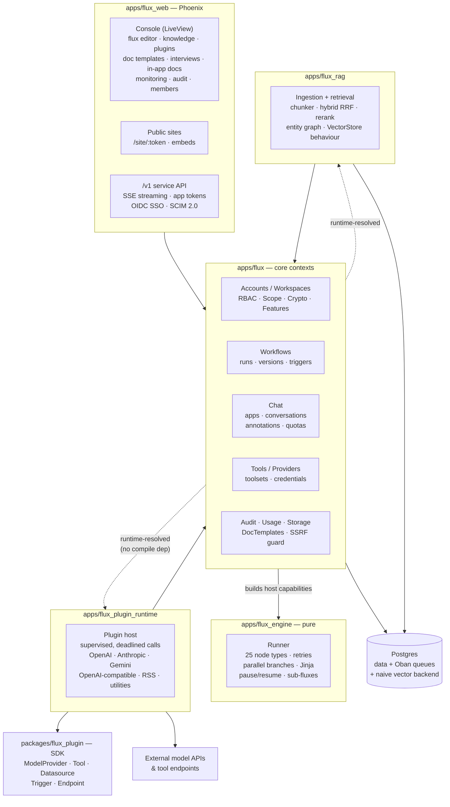
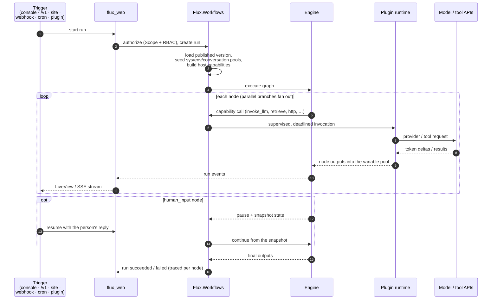

# ⚡ FluxCapacitor

*Where we're going, we don't need boilerplate.*

FluxCapacitor is a self-hostable platform for building, running, and publishing
AI-powered apps on the BEAM. You design **fluxes** — executable workflow graphs —
in a visual editor, wire them to models, tools, and knowledge bases, and ship
them as chat apps, form apps, embeddable widgets, or plain HTTP APIs. Everything
runs in one Elixir/Phoenix umbrella: no sidecar services, no external
orchestrator, no queue infrastructure beyond Postgres.

## What it does

- **Visual workflow engine** — 25 node types (LLM, agent loops — with
  **human tool approval**: flagged tools pause the run for an
  approve/deny before executing — with multi-select
  **align/distribute** tools on the canvas — branching,
  iteration and bounded loops over sub-fluxes — **pinnable to a specific
  published version** for reproducible composition — a **sub-flux call
  node** that runs any published flux as a single step (inputs mapped
  from templates, its outputs flowing back) — code execution, HTTP,
  knowledge retrieval, human-input and labeling pause/resume, classifiers,
  extractors, **timed delays** (seconds or until a timestamp, for pacing
  rate-limited APIs), and more) with
  retries, error branches, **parallel branch fan-out**, model fallback chains,
  environment/conversation variables — plus **workspace-wide
  environment variables** (`{{env.NAME}}`, encrypted, secrets
  write-only, shared by every flux) — versioning, and rollback. Template nodes
  render simple `{{refs}}`, a **Jinja subset** (filters, conditionals, loops),
  or reusable **doc templates** from a workspace library. **Document
  assembly**, docassemble-style: upload Word templates with Jinja tags, run
  stored **interviews** (reusable question forms that pause a run), and the
  document node fills the template into a downloadable .docx or PDF. A
  **file-output node** writes any templated content straight to a
  downloadable HTML, PDF, Markdown, text, CSV, or JSON file — report
  writing without a Word template. An **AI
  helper** drafts a flux from a plain-language description and **revises
  existing drafts on instruction** (both engine-validated before they touch
  the canvas), and code nodes run in a **sandboxed runner**
  with a pre-installed ML toolkit (numpy, pandas, scikit-learn, xgboost,
  lightgbm, and friends — zero-install imports) where python user code is
  confined to an **empty network namespace**.
- **Evaluate and improve** — per-flux **eval sets** (hand-written, CSV
  imports, or captured from real runs; cases carry **weights**) scored by
  exact/contains/**regex** graders or
  an **LLM-as-judge** with a selectable judge model, against the draft or
  any published version, so versions compare side by side before you
  publish — and sets marked as **gates** run automatically on publish and
  block it on regression, while sets given a **cron schedule** re-score the
  latest published version unattended (drift detection between releases).
  **Batch runs** execute the draft *or a pinned published version* over a
  CSV of inputs with live counters, a results export, one-click hand-off
  of completed rows to labeling, and a **Repeat button** that saves the
  row set as a recurring cron batch. Every run
  records **token usage and an estimated cost** (per-model breakdown;
  dashboard rollups and a workspace-wide **runs page** with filters,
  cost totals, and **one-click re-runs**). A **monthly token budget**
  warns at 80% and refuses runs past the cap, an opt-in **LLM
  response cache** answers identical prompts from memory at zero cost,
  and an always-on **embedding cache** does the same for vectors — so
  re-indexing never pays for unchanged text twice.
  Published versions **diff structurally** against the draft (nodes
  added/removed/changed, edges rewired) right in the versions modal, and
  an **A/B split** sends a share of live traffic (chatflows, sites, API,
  triggers) to a second published version with per-arm run stats. Run
  drill-ins render a **timeline waterfall** per node with **per-node
  token attribution**, any **two runs compare side by side** (status,
  I/O, per-node timings and tokens aligned by node), any node can
  **replay a finished run from that point** — upstream outputs are
  reused, not re-paid — batches **retry only their failed rows**, runs
  are **text-searchable** by content and **export as JSONL** with full
  per-node traces, deterministic nodes opt into **output caching**
  (`cache_minutes` skips identical calls), webhooks keep a **delivery
  log** with manual retry, and `FLUX_ADMIN_EMAILS` unlocks an
  **instance admin panel** with a **per-provider health table** (calls,
  errors, error rate since boot). The Fluxes index shows **7-day health
  badges** per flux, the dashboard carries a live-refreshing **activity
  feed**, and the canvas shows **who else is editing** via presence
  avatars. Run counts, durations, **tokens, and
  estimated cost** all export as Prometheus metrics onto the provisioned
  Grafana dashboard.
  **Guardrails** (regex deny patterns) block or flag inputs and flag
  outputs, a **weekly digest** rolls up each workspace's activity, and
  datasets, labeling projects, and **conversations** get the same
  **30-day trash** as fluxes and apps. Published versions take an
  optional **release note**, shown beside each entry in the versions
  modal. Liked replies and annotations export as **fine-tune
  JSONL**, and **native data labeling** closes the custom model loop:
  labeling projects with a tagging queue (single/multi choice or free-text
  correction, keyboard shortcuts, multi-labeler claims and per-labeler
  stats), rated replies pushed in from the monitor, CSV intake, relabeling,
  and JSONL export. Projects can require **N labels per task** — votes
  collect until quorum, the majority label wins, and the console reports
  **inter-labeler agreement** (plus `labeling.*` webhook events for
  pipelines). Labeled tasks promote to **gold standards** (honeypots) that
  re-enter the queue and score **per-labeler accuracy**; a **Quality
  panel** on the dashboard rolls up gates, recent eval scores, queue
  depth, and agreement, and a **Files page** browses every stored run
  output and artifact. A **labeling node** pauses a run mid-graph until a
  human labels the task — the label becomes the node's outputs. Code nodes
  persist trained models as **run artifacts** (`./artifacts/`) and load
  them back as **attachments** (with an artifact picker in the editor) —
  label → train → serve entirely inside fluxes, no external labeling
  service — and a **model registry** names and versions those artifacts
  ("ticket-intent v3"), leading the attachment picker; `registry:<name>`
  references resolve to the **latest version at run time**, so promoting
  a model updates every serving flux without edits. A **version
  comparison matrix** on the evals page shows the latest score per set
  and target side by side, and **in-console notifications** surface run
  failures, eval regressions, and labeling completions with an unread
  badge. Batches, evals, and labeling are all drivable over the
  **`/v1` API** for CI and data pipelines — covered by the strict OpenAPI
  contract at `GET /v1/spec` — and a **template gallery** (triage, RAG,
  human review, model trainer, report writer, intent router, plus
  workspace-saved **custom templates**) seeds new fluxes; a selection
  on the canvas **extracts into a new flux** (outside references become
  start variables), any node can carry its own **timeout**, and
  **Ctrl/Cmd-F finds nodes on the canvas** by title, type, or id
  (matches highlight, the view jumps to the first), and the run panel
  keeps **named input presets** so test values load in one click. Workspace
  export archives carry the whole quality loop — eval sets, labeling
  projects with labels and gold standards, retrieval cases — so backups
  restore it intact.
- **Apps on top of fluxes** — chat, completion (form), and chatflow modes;
  published to logged-out visitors at a public URL, embedded via iframe or a
  floating chat bubble, or consumed through the `/v1` service API with
  per-app tokens, streaming SSE, quotas, and rate limits (**overridable
  per app**) — including an
  **OpenAI-compatible `POST /v1/chat/completions`** (blocking and
  streaming) that reaches **chatflow apps too** (bridged through their
  flux), speaks **function calling** (`tools` pass through to the
  app's model, `tool_calls` come back, tool results round-trip — on
  direct-model apps) and **structured outputs** (`response_format`
  with a JSON schema — forced, validated, one corrective retry), plus **OpenAI-compatible `/v1/embeddings`** and a
  **`GET /v1/models` listing** for SDK autodiscovery, so any OpenAI SDK
  talks to apps and embedding models with a base-URL swap — plus
  **OpenAI-shaped audio endpoints** (`/v1/audio/transcriptions`,
  `/v1/audio/speech`) and an **Anthropic-compatible `POST
  /v1/messages`** (blocking and streaming), so Claude SDKs point at
  apps the same way. Runs are fully API-drivable too: start, resume,
  **inspect with a per-node trace**, and **stop**. Monitoring pages
  track usage, feedback and quality trends, **topic clusters** of what
  people actually ask, a **per-visitor rollup** (conversations,
  messages, tokens, feedback per `end_user_ref` — and visitors rate
  replies **👍/👎 right on the public site**), and **annotation
  replies** promote
  liked answers into canonical responses (exact + embedding-fuzzy
  matched) — importable and exportable as **CSV** for bulk curation.
  Assistant replies **render markdown** (safely — escape-first, no raw
  HTML) in both the console and public sites — **streamed chunks render
  live**, not just the finished reply — with a **Regenerate button**, a
  **copy button** on every reply, opt-in **follow-up question chips**
  after each answer, and **image uploads** straight from the chat box
  for vision models. The console chat **resumes your latest
  conversation**, switches between recent ones, **searches across
  threads** (titles and message bodies), and **renames or deletes**
  them from the switcher, same as public sites do for visitors.
  Published sites carry **OpenGraph/meta tags and a favicon** from the
  app's theme, so shared links unfurl with the app's identity. API
  tokens are **perpetual or expiring by choice** (30/90/365 days),
  show **expiry and last-used**, revoke in one click, and expired ones
  answer `401 token_expired` — with **workspace-level `ws-` keys**
  (minted on the settings page) alongside per-app and per-flux ones.
  Apps and fluxes **duplicate in one click** (config and draft graph
  copied, publish state reset), and any conversation **downloads as
  Markdown or JSON** from the chat header. Chat apps can name a
  **fallback model** — one retry on another provider when the primary
  errors, recorded on the reply — and chatflows keep **conversation
  variables** (slots written by variable-assigner nodes) inspectable
  right above the console chat. Long chats stay coherent through
  **rolling conversation memory** (older turns fold into a maintained
  summary instead of overflowing the window — chatflows fold the same
  way into `{{sys.history}}`), **push-to-talk voice
  input** transcribes through the provider's Whisper-style endpoint,
  and every reply has a **read-aloud button** — **real provider voices**
  when the provider has a speech endpoint, browser voices otherwise.
  Guardrails gain **model-backed moderation** — the workspace default
  model judges content against your policy alongside the regex
  patterns. Chat apps run **model A/B tests**: a challenger model takes
  a chosen share of conversations (stable per conversation) and the
  monitoring page compares replies, feedback, and tokens per variant —
  and **conversation-level evals** replay scripted multi-turn dialogues
  through the app, with an LLM judge scoring the whole transcript
  (score drops raise a notification). A **concurrent-run cap** protects
  provider limits, and notification kinds **route to chosen webhook
  endpoints** (`notification.*` events) or arrive **by email** per
  member (account settings opt-in). A dashboard **getting-started
  checklist** walks new workspaces through provider → flux → publish →
  knowledge → first run → invite, a **Ctrl+K command palette** jumps to
  any page, flux, app, or dataset by name, destructive actions confirm
  through **themed modal dialogs** (no native browser popups), and an
  **API reference** generated from the live OpenAPI spec — **with a
  copy-pasteable curl example per endpoint** — sits alongside the
  guides at /console/docs.
- **Knowledge (RAG)** — datasets → documents → embedded segments, hybrid
  retrieval (vector cosine + Postgres full-text + **entity mentions**, merged
  by reciprocal rank fusion), optional reranking, URL ingestion (with a
  **depth-1 crawl** of same-site links, and **remembered sources
  re-fetched nightly** — or on demand with a **fetch-now button** —
  replacing their documents in place), **PDF and
  Office uploads** extracted through Tika right in the console,
  datasource auto-sync, multi-dataset queries, per-dataset retrieval settings
  (with a **chunk preview** that dry-runs the settings on pasted text,
  including **markdown-aware chunking**, **parent-child chunking** —
  small child chunks embedded for precise matching, the enclosing
  parent section returned for context — model-backed **query
  expansion**, and **document tags** the knowledge node filters by), and
  citations that flow onto chat answers. Similarity ranks in-BEAM by default, in SQL with the
  **pgvector backend** (`FLUX_VECTOR_BACKEND=pgvector`, HNSW-indexed with
  `FLUX_VECTOR_DIMS`) or in AQL with the **Arango vector backend**, and
  the **ArangoDB entity graph** (`FLUX_ARANGO_URL`) upgrades
  related-entity lookups to real 1–2 hop weighted traversals.
  **Retrieval evals** (golden question → expected-passage cases, hit rate
  + MRR per dataset) make chunking and backend changes measurable — and
  a **cron on the dataset re-scores them unattended**, raising a
  notification when hit rate or MRR drops.
- **Plugins** — one SDK (`packages/flux_plugin`) with five capability
  behaviours: **model providers** (OpenAI, Anthropic, Gemini, **Azure
  OpenAI** deployments, **Amazon Bedrock** Claude models with hand-rolled
  SigV4, any OpenAI-compatible endpoint), **tools**, **datasources** (external document
  collections that sync into datasets), **triggers** (polled event sources
  that start runs), and **endpoints** (plugins that serve HTTP). Installed
  per workspace, credentials encrypted per workspace. Built-in **LlamaIndex
  tool plugin** (retrieve from LlamaCloud managed indexes or call
  llama_deploy workflow services as functions inside a flux), plus **Notion**,
  **S3-compatible**, and **Google Drive** (service-account) datasources.
  **Ollama** runs local models with zero config — the model list
  auto-discovers from whatever `ollama pull` installed — and a **model
  playground** races one prompt across up to four models side by side
  (latency, tokens, cost per column; one click promotes the winner to
  workspace default). Providers with an image endpoint gain
  **text-to-image** (`invoke_image`, OpenAI images shape) — a built-in
  **Images toolset** puts `generate_image` in every tool and agent
  node's picker, with results landing on the Files page — and **LLM
  nodes see images**: point a `vision_variable` at an uploaded image
  and it rides the prompt to vision-capable models.
  **MCP goes both ways**: register any Model Context Protocol server
  (Streamable HTTP, encrypted auth headers) and its tools join the picker
  for tool and agent nodes — and FluxCapacitor is itself an MCP server at
  `POST /mcp`, advertising every published flux as a callable tool
  (input schema derived from its start variables), the **prompt
  library** (named snippets inserted from LLM/agent panels — now
  **versioned**, edits archive and history restores) exposed
  **as MCP prompts**, and **dataset documents as MCP resources** —
  authenticated with a workspace `ws-` key, so Claude and any other MCP
  client can run your fluxes and read your knowledge directly. Agent
  nodes attach **several toolsets at once** (OpenAPI + plugin + MCP
  mixed, colliding names deduped).
- **Enterprise-grade tenancy** — workspaces with role-based access control
  (built-in + custom roles), **OIDC and SAML 2.0 single sign-on** (point
  `SAML_IDP_METADATA_FILE` at your IdP's metadata and the login page
  grows an SSO button), **SCIM 2.0
  provisioning**, plan-based feature gating, a repo-level tenancy guard on
  every query against tenant tables, per-workspace encryption keys, an
  append-only audit trail (**date-filterable, exports as CSV**),
  workspace export/import archives with a **rehearsed restore
  runbook**, and per-account **session management** (see every signed-in
  device **with its IP and browser**, revoke one, or log out everywhere).
  Costs stay honest with **workspace price overrides** (self-hosted and
  fine-tuned models priced per million tokens), **per-flux monthly
  budgets** beside the workspace one, and same-named document re-uploads
  **replace in place** instead of duplicating. Datasets also take
  **image uploads** (described and text-transcribed by the workspace
  vision model, indexed like any document), **typed metadata per
  document** that retrieval and the knowledge node filter on, and a
  **run-a-flux-over-this-dataset** button that turns every document
  into a batch row (batches run rows **in parallel** when asked, up to
  8 at once — and completed batches **land their outputs back into a
  dataset**, closing the generate→index circle), and **audio uploads** (voice memos, meeting recordings)
  transcribe through the provider into searchable documents. The
  dataset browser takes **bulk document operations** — multi-select to
  enable/disable (disabled documents stay indexed but retrieval skips
  them), tag, or delete several at once — plus a **content search box**
  over the dataset's segments, ingestion fires **webhook events**
  (`document.indexed`, `document.failed`, `dataset.synced`), and whole
  datasets **export/import as portable archives** (documents, tags,
  metadata, retrieval cases — re-indexed on arrival). Site
  visitors can **ask for a human** — the
  conversation flags into a console queue and a teammate's reply lands
  in the visitor's chat live — and conversations take **labels** for
  triage. Guardrails gain a **redact action** (matches masked with
  `•••` in messages, replies, and run inputs instead of refusing), and
  public site chat is **flood-protected** per visitor and per site.
- **Operations built in** — Oban (on Postgres) is the platform's only
  scheduler: cron/interval triggers, document indexing, retention sweeps,
  batch and eval execution, and **signed outgoing webhooks** (per-workspace
  endpoints subscribed to run lifecycle events, HMAC-SHA256, retried) are
  all queues in the same database.
  Prometheus metrics, OpenTelemetry traces, and structured JSON logs are one
  env var away; golden run fixtures replay recorded workflows in CI.
  Production email (confirmation, magic links) speaks **SMTP to any
  relay** with four env vars (`FLUX_SMTP_HOST` + friends), the admin
  panel shows **background job queues** (depths by state, failing jobs
  with their last error, retry/cancel in place), structured LLM output
  is **validated against its JSON schema with one corrective retry**,
  and the codebase holds the line with **sobelow, credo, deps.audit,
  and dialyzer** wired into the workflow. A public **/status page**
  shows component health with an admin-editable incident note (an
  optional Uptime Kuma compose profile watches the same probes),
  webhooks speak **Slack Block Kit** on request, failing runs hand off
  via **read-only share links**, the canvas exports as **SVG**,
  monitoring tables download as **CSV**, the LLM cache reports its
  **hit rate**, owners can **archive workspaces** instead of deleting,
  a **monthly cost report** emails opted-in members on the 1st, a
  daily **cost-spike alert** flags a workspace whose spend suddenly
  doubled its trailing average, a **schedule watchdog** flags automation
  that silently stopped firing, the admin health table keeps a **recent
  provider-call log** (model, latency, outcome), and an
  instance-admin **announcement banner** tops every console page for
  maintenance windows and migration notices.

## Architecture

The umbrella enforces a strict dependency direction: pure logic at the bottom,
side effects at the edges. The engine knows nothing about Phoenix, Ecto, or
HTTP — it executes graphs against **host capabilities** (function bundles)
that the core builds per run.



Two edges deserve explanation:

- **`flux → flux_engine` (solid):** the core compiles against the engine and
  hands it a *host* — a map of capability functions (`invoke_llm`,
  `http_request`, `run_code`, `retrieve_knowledge`, `run_subflux`,
  `fetch_doc_template`, …). The engine calls capabilities; it never touches
  the database or the network itself. That keeps every node type
  unit-testable with plain maps.
- **`flux ⇢ flux_plugin_runtime` / `flux ⇢ flux_rag` (dashed):** the core
  *uses* the plugin runtime and RAG but must not compile-depend on them
  (they depend on core). Resolution happens at runtime via application config,
  which is also how tests swap in fakes.

### A run, end to end



Runs finish `succeeded`/`failed`/`stopped` — or **pause** on a human-input
node, snapshotting state so anyone (console, site, or API) can resume later.
Telemetry lands in Prometheus/OTEL; failures can ping a per-workspace signed
webhook; retention sweeps prune old runs nightly.

## Repository layout

| Path | Purpose |
|---|---|
| `apps/flux` | Core contexts: accounts, workspaces, RBAC, SSO/SCIM, workflows/runs, chat apps, annotations, doc templates, tools, providers, usage, licensing, audit, storage, crypto |
| `apps/flux_engine` | Pure workflow engine — no Ecto/Phoenix/HTTP, just graph execution against host capabilities (plus the Jinja subset and graph linter) |
| `apps/flux_plugin_runtime` | In-BEAM plugin host: built-in providers/tools/datasources/triggers/endpoints, supervised invocation |
| `apps/flux_rag` | Knowledge pipeline: chunking, embedding via Oban, hybrid retrieval, entity graph, vector-store behaviour |
| `apps/flux_web` | Phoenix: LiveView console, public app/flux sites, `/v1` API, SCIM, OIDC, metrics endpoint |
| `packages/flux_plugin` | The plugin SDK — implement a behaviour, return a manifest, and the runtime hosts it |
| `docs/` | Architecture decisions and the development plan/ledger |

## Documentation

The guides live in `docs/guides` and also render **inside the console** at
`/console/docs` (they compile into the release):

- [Getting started](docs/guides/getting-started.md) — clone to published app, including `mix flux.demo`, production notes, and localization
- [Node reference](docs/guides/node-reference.md) — all 25 node types in detail, branching, parallel fan-out, sub-fluxes
- [Plugin SDK](docs/guides/plugin-sdk.md) — the five capability behaviours with a worked example
- [Service API](docs/guides/service-api.md) — the `/v1` surface, SSE framing, webhooks, SCIM
- [Operations](docs/guides/operations.md) — cost controls, guardrails, health probes, `mix flux.doctor`, metrics, backups

## Getting started

```bash
mix setup            # deps, database, assets
mix phx.server       # console at http://localhost:4000
```

Or with Docker:

```bash
docker compose up -d                    # postgres + minio
docker compose --profile full up -d     # + the app itself
docker compose --profile rag up -d      # + arangodb/tika (future RAG backends)
docker compose --profile metrics up -d  # + prometheus & provisioned grafana
                                        #   dashboard (localhost:3001, admin/fluxgrafana)
```

The Echo provider ships built-in with deterministic chat/embedding/rerank
models, so you can build and run fluxes, apps, and knowledge bases end to end
before configuring any real provider credentials. `mix flux.demo` seeds a
showcase workspace — a triage flux, a RAG chatflow, an agent with a
scratch drive, and a labeling project wired to the Model trainer flux
(the label → train loop, ready to click through) — entirely on Echo.

## Testing

```bash
mix test                             # full umbrella suite (~720 tests), hermetic
```

The suite runs with no network: providers stub through `Req.Test` or the
deterministic Echo plugin, the PDF converter and code runner inject fake
modules, and storage writes to a temp directory. To run one app's tests,
`cd` into it first (`cd apps/flux && mix test`) — from the umbrella root,
`mix test apps/flux` silently runs *nothing*.

Beyond the unit/integration suite:

- **Golden replay fixtures** (`apps/flux_web/test/support/golden/`) —
  recorded runs re-execute on Echo and must reproduce their outputs and
  per-node status sets. Record new ones from the editor's run history.
- **Reference parity traces** (`harness/`) — deterministic DSL fixtures
  recorded against a live instance of the reference platform replay on
  our engine and must match its outputs and executed-node set exactly.
- **`/v1` contract tests** — strict OpenAPI schemas
  (`additionalProperties: false`) validated over every route.
- **Coderunner live checks** (`coderunner/test_server.py`) — 14 checks
  against the running container proving what mocks can't: JS network
  denial, memory-bomb and timeout kills, dependency-name validation,
  venv caching, and the zero-install ML toolkit.
- **Perf guard** (opt-in: `mix test --include perf test/perf` in
  `apps/flux_web`) — retrieval/monitor/rollup timings over a
  10k-segment corpus, plus the quality loop at scale: runs-page reads
  over 5k runs, a real 200-row batch and 100-case eval on Echo, and
  labeling-queue reads over 5k tasks.

## Configuration

Key environment variables in production (see `.env.docker.example`):

| Variable | Purpose |
|---|---|
| `DATABASE_URL`, `SECRET_KEY_BASE`, `PHX_HOST` | Standard Phoenix release settings |
| `FLUX_MASTER_KEY` | Root key for per-workspace credential encryption |
| `STORAGE_BACKEND=s3` + `S3_*` | File storage backend (local disk by default; any S3-compatible endpoint, e.g. MinIO) |
| `FLUX_ROLE` | `all` (default), `web`, or `worker` — splits web serving from queue processing |
| `FLUX_OIDC_*` | OIDC single sign-on (issuer, client id/secret) |
| `FLUX_PDF_URL` | Gotenberg-compatible converter for document-node PDF output (`documents` compose profile) |
| `FLUX_TIKA_URL` | Apache Tika server for office-format text extraction (`rag` compose profile) |
| `CODE_RUNNER_URL`, `CODE_RUNNER_API_KEY` | The flux-coderunner service for code nodes (`code` compose profile) |
| `FLUX_METRICS` | Expose Prometheus metrics at `/metrics` |
| `FLUX_LOG_JSON` | Structured JSON logs |
| `OTEL_EXPORTER_OTLP_ENDPOINT` | OpenTelemetry trace export |
| `FLUX_SSRF_ALLOW` | Hostnames exempted from the outbound-HTTP SSRF guard |
| `FLUX_VECTOR_BACKEND` | `pgvector` ranks similarity in SQL (compose Postgres ships the extension) |
| `FLUX_ARANGO_URL` | ArangoDB entity-graph backend for related-entity traversal (`rag` compose profile) |
| `FLUX_ADMIN_EMAILS` | Comma-separated accounts allowed into the instance admin panel |
