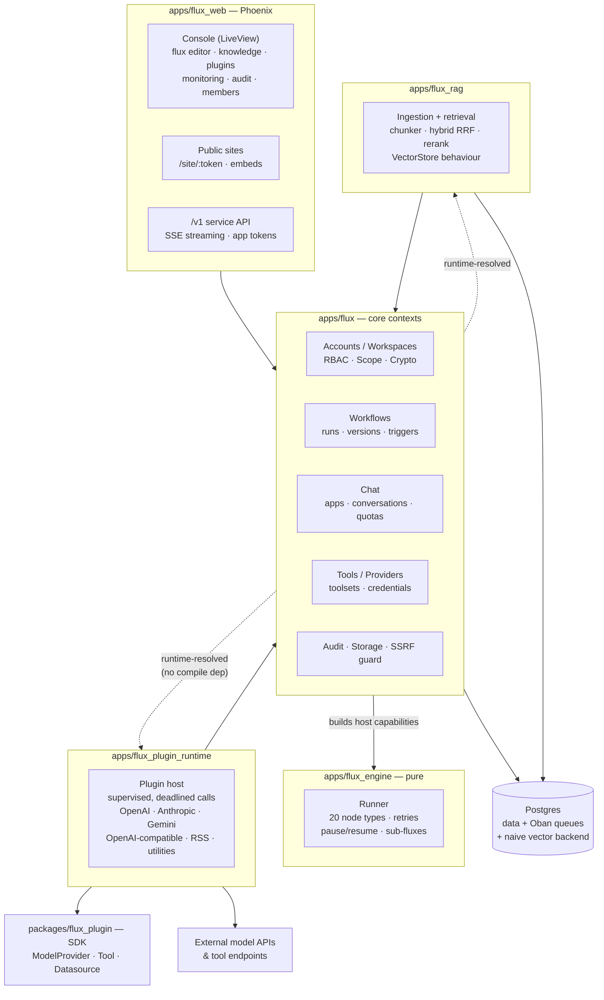

# ⚡ FluxCapacitor

*Where we're going, we don't need boilerplate.*

FluxCapacitor is a self-hostable platform for building, running, and publishing
AI-powered apps on the BEAM. You design **fluxes** — executable workflow graphs —
in a visual editor, wire them to models, tools, and knowledge bases, and ship
them as chat apps, form apps, embeddable widgets, or plain HTTP APIs. Everything
runs in one Elixir/Phoenix umbrella: no sidecar services, no external
orchestrator, no queue infrastructure beyond Postgres.

## What it does

- **Visual workflow engine** — 20 node types (LLM, agent loops, branching,
  iteration over sub-fluxes, code execution, HTTP, knowledge retrieval,
  human-input pause/resume, classifiers, extractors, and more) with retries,
  error branches, environment/conversation variables, versioning, and rollback.
- **Apps on top of fluxes** — chat, completion (form), and chatflow modes;
  published to logged-out visitors at a public URL, embedded via iframe or a
  floating chat bubble, or consumed through the `/v1` service API with
  per-app tokens, streaming SSE, quotas, and rate limits.
- **Knowledge (RAG)** — datasets → documents → embedded segments, hybrid
  retrieval (vector cosine + Postgres full-text merged by reciprocal rank
  fusion), optional reranking, URL ingestion, multi-dataset queries, and
  citations that flow onto chat answers.
- **Plugins** — one SDK (`packages/flux_plugin`) with capability behaviours:
  model providers (OpenAI, Anthropic, Gemini, any OpenAI-compatible endpoint),
  tools (callable operations for tool/agent nodes), and datasources (external
  document collections that sync into datasets). Installed per workspace,
  credentials encrypted per workspace.
- **Multi-tenant by construction** — workspaces with role-based access control
  (built-in + custom roles), a repo-level tenancy guard on every query against
  tenant tables, per-workspace encryption keys, and an append-only audit trail.
- **Operations built in** — Oban (on Postgres) is the platform's only
  scheduler: cron/interval triggers, document indexing, retention sweeps, and
  failure-alert webhooks are all queues in the same database. Prometheus
  metrics, OpenTelemetry traces, and structured JSON logs are one env var away.

## Architecture

The umbrella enforces a strict dependency direction: pure logic at the bottom,
side effects at the edges. The engine knows nothing about Phoenix, Ecto, or
HTTP — it executes graphs against **host capabilities** (function bundles)
that the core builds per run.



Two edges deserve explanation:

- **`flux → flux_engine` (solid):** the core compiles against the engine and
  hands it a *host* — a map of capability functions (`invoke_llm`,
  `http_request`, `run_code`, `retrieve_knowledge`, `run_subflux`, …). The
  engine calls capabilities; it never touches the database or the network
  itself. That keeps every node type unit-testable with plain maps.
- **`flux ⇢ flux_plugin_runtime` / `flux ⇢ flux_rag` (dashed):** the core
  *uses* the plugin runtime and RAG but must not compile-depend on them
  (they depend on core). Resolution happens at runtime via application config,
  which is also how tests swap in fakes.

### A run, end to end

1. A trigger fires — console click, `/v1` call, public site, webhook, or an
   Oban cron tick.
2. `Flux.Workflows` loads the published version, seeds variable pools
   (`sys`/`env`/`conversation`), builds the host, and starts a supervised run.
3. The engine walks the graph node by node, emitting events the web layer
   streams out over LiveView or SSE. LLM calls stream token deltas through
   the plugin runtime, each plugin invocation supervised with a deadline.
4. Runs finish `succeeded`/`failed` — or **pause** on a human-input node,
   snapshotting state so anyone (console or API) can resume later.
5. Telemetry lands in Prometheus/OTEL; failures can ping a per-workspace
   webhook; retention sweeps prune old runs nightly.

## Repository layout

| Path | Purpose |
|---|---|
| `apps/flux` | Core contexts: accounts, workspaces, RBAC, workflows/runs, chat apps, tools, providers, audit, storage, crypto |
| `apps/flux_engine` | Pure workflow engine — no Ecto/Phoenix/HTTP, just graph execution against host capabilities |
| `apps/flux_plugin_runtime` | In-BEAM plugin host: built-in providers/tools/datasources, supervised invocation |
| `apps/flux_rag` | Knowledge pipeline: chunking, embedding via Oban, hybrid retrieval, vector-store behaviour |
| `apps/flux_web` | Phoenix: LiveView console, public app/flux sites, `/v1` API, metrics endpoint |
| `packages/flux_plugin` | The plugin SDK — implement a behaviour, return a manifest, and the runtime hosts it |
| `docs/` | Architecture decisions and the development plan/ledger |

## Documentation

- [Getting started](docs/guides/getting-started.md) — clone to published app, including `mix flux.demo`
- [Node reference](docs/guides/node-reference.md) — all 21 node types, branching, parallel fan-out, sub-fluxes
- [Plugin SDK](docs/guides/plugin-sdk.md) — the five capability behaviours with a worked example
- [Service API](docs/guides/service-api.md) — the `/v1` surface, SSE framing, webhooks, SCIM

## Getting started

```bash
mix setup            # deps, database, assets
mix phx.server       # console at http://localhost:4000
```

Or with Docker:

```bash
docker compose up -d                    # postgres + minio
docker compose --profile full up -d     # + the app itself
docker compose --profile rag up -d      # + arangodb/tika (future RAG backends)
```

The Echo provider ships built-in with deterministic chat/embedding/rerank
models, so you can build and run fluxes, apps, and knowledge bases end to end
before configuring any real provider credentials.

```bash
mix test             # full umbrella suite, hermetic (no network, fake or Echo providers)
```

## Configuration

Key environment variables in production (see `.env.docker.example`):

| Variable | Purpose |
|---|---|
| `DATABASE_URL`, `SECRET_KEY_BASE`, `PHX_HOST` | Standard Phoenix release settings |
| `FLUX_MASTER_KEY` | Root key for per-workspace credential encryption |
| `STORAGE_BACKEND=s3` + `S3_*` | File storage backend (local disk by default; any S3-compatible endpoint, e.g. MinIO) |
| `FLUX_ROLE` | `all` (default), `web`, or `worker` — splits web serving from queue processing |
| `FLUX_METRICS` | Expose Prometheus metrics at `/metrics` |
| `FLUX_LOG_JSON` | Structured JSON logs |
| `OTEL_EXPORTER_OTLP_ENDPOINT` | OpenTelemetry trace export |
| `FLUX_SSRF_ALLOW` | Hostnames exempted from the outbound-HTTP SSRF guard |
